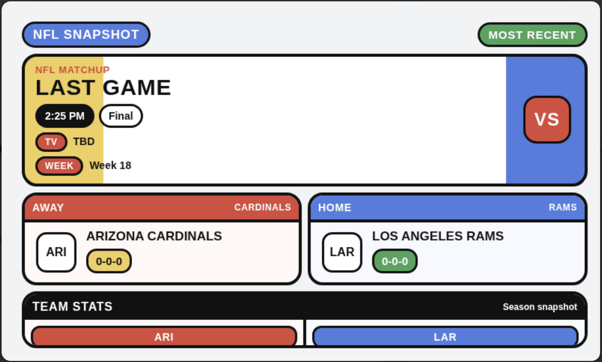
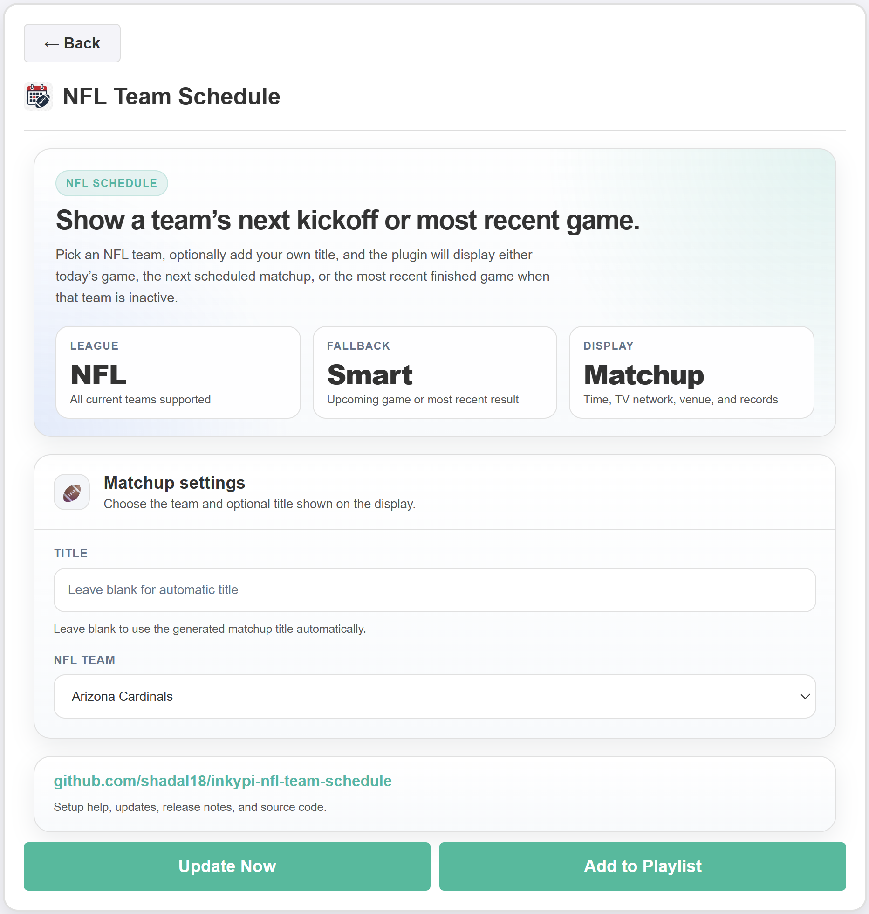

# InkyPi NFL Team Schedule

A plugin that shows an NFL team’s next matchup or most recent game on an InkyPi display with a clean, glanceable layout and configurable team selection.

_NFL Team Schedule_ is a plugin for [InkyPi](https://github.com/fatihak/InkyPi) that displays a selected NFL team’s upcoming game, or falls back to the most recent game when no upcoming matchup is available. It uses ESPN’s public-facing NFL data endpoints, which are widely used by developers but are unofficial and may change over time.

## Install

Use the InkyPi plugin installer with the plugin ID and this repository URL, following the same plugin structure described in the InkyPi plugin documentation.

```bash
inkypi plugin install nfl_team_schedule https://github.com/shadal18/inkypi-nfl-team-schedule
```

## Update

To update the plugin on your InkyPi device:

1. SSH into your InkyPi host.
2. Change into the plugin directory:
   ```bash
   cd ~/InkyPi/src/plugins/nfl_team_schedule
   ```
3. Run this update command:
   ```bash
   git pull origin main && \
   if [ -d nfl_team_schedule ]; then \
     rsync -a nfl_team_schedule/ ./ && \
     rm -rf nfl_team_schedule; \
   fi && \
   sudo systemctl restart inkypi.service
   ```

If you don’t see your changes after updating:

- Confirm you are in the correct plugin folder.
- Clear your browser cache or hard refresh the InkyPi web UI.
- Check the InkyPi logs for any plugin errors.
- Restart the InkyPi service manually if needed:
  ```bash
  sudo systemctl restart inkypi.service
  ```

## Requirements

- Network access from the InkyPi device to ESPN’s public NFL data endpoints.
- An active internet connection so the plugin can retrieve schedule, status, broadcast, venue, and standings-style team data.

## Features

This plugin is an extension for the InkyPi e-paper display frame and includes the following features.

- Shows the selected NFL team’s next scheduled game.
- Falls back to the most recent game when no upcoming game is available.
- Displays matchup time and day.
- Displays venue information.
- Displays broadcast network information when available.
- Displays both teams in the matchup.
- Displays team logos when logo assets are available.
- Displays season snapshot stats including wins, losses, ties, points for, and points against.
- Supports an optional custom title from the settings page.
- Clean layout optimized for quick glance reading on e-paper.

## Settings

The plugin settings page lets you customize:

- Title.
- NFL team.

## Repository

GitHub repository:

[https://github.com/shadal18/inkypi-nfl-team-schedule](https://github.com/shadal18/inkypi-nfl-team-schedule)

## Notes

This plugin relies on ESPN’s unofficial public API surface, so endpoint shapes or field names may change without notice. If ESPN changes those responses, the plugin may need updates to restore schedule or standings parsing.

## Screenshots

- NFL Team Schedule plugin.
- Settings.

  
  
